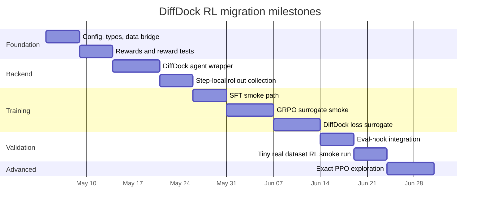

# DiffDock Post-Training RL Setup for Option2 Migration

## Executive summary

The highest-confidence way to migrate PepFlow Option2-style fine-tuning to DiffDock is to treat **DiffDock’s score model as the policy**, **grouped pose samples per complex as rollouts**, and **terminal pose quality as reward**, but to begin with **GRPO-style group-relative optimization** rather than exact PPO. PepFlow’s public paper and repo expose a multimodal flow-matching model with explicit per-modality losses and modality-controlled sampling, while DiffDock’s public paper and repo expose a diffusion docking model over ligand **translation, rotation, and torsion**, plus a separate confidence model and a training path centered on decomposed score-matching losses and inference-time sampling. That makes a direct “exact PPO over action log-probs” port unrealistic for this project, and makes **surrogate GRPO built on grouped DiffDock poses and per-complex normalized rewards** the right starting point. citeturn20view4turn33view3turn6view1turn24view0turn29view3turn29view4

DiffDock already provides most of the mechanical pieces needed for this: batched inference over many complexes through a CSV adapter, multiple samples per complex, separate score and confidence checkpoints, ranking by confidence, and per-complex SDF outputs. Its training code already exposes translation, rotation, torsion, and optional backbone/sidechain loss terms, supports non-mean loss computation, logs validation inference metrics, and saves best checkpoints. The practical migration is therefore: implement a typed RL data layer, compute rewards on generated poses, define a DiffDock sample score \(s_\theta = -\ell_{\text{DD}}\), add a ground-truth supervised anchor, add a frozen-reference regularizer, and keep exact PPO out of scope unless sampler instrumentation becomes available. citeturn28view3turn27view0turn17view1turn17view2turn24view1turn24view2turn24view4

Another key conclusion is architectural rather than mathematical: **a single stale `generated_samples_manifest.json` is not enough for real GRPO training**. Baseline generation artifacts are useful for reward debugging and offline warm-start experiments, but actual post-training should produce **step-local rollout manifests** inside the RL run directory. citeturn29view2turn29view3

Finally, confidence must be handled carefully. DiffDock’s README states that the confidence output is **not a binding affinity prediction**, and also warns that confidence values are hard to compare across different complexes. That makes confidence useful as a pose-quality proxy or auxiliary reward, but not as a standalone global reward scale across targets. RMSD, when available, should remain the primary training-time reward for supervised validation and most initial RL experiments. citeturn5view4

## Method mapping and sources to prioritize

The sources Codex should prioritize during implementation are, in order: DiffDock repo files `inference.py`, `train.py`, `utils/training.py`, `confidence/*`, and `evaluate.py`; the DiffDock ICLR 2023 paper and follow-up confidence-bootstrapping paper; the PepFlow ICML 2024 paper and `models_con/flow_model.py`; Williams’ REINFORCE paper; Schulman et al.’s PPO paper; and the GRPO section in DeepSeekMath. The most implementation-relevant evidence is in repo code rather than abstracts. citeturn28view3turn24view0turn17view0turn19view0turn23view3turn20view4turn33view3turn4view3turn29view4turn29view3

PepFlow’s paper describes a multimodal generator over backbone frames in SE(3), side-chain angles on tori, and sequence tokens on a simplex, and the repo shows that `forward()` returns multiple loss terms while `sample()` supports `sample_bb`, `sample_ang`, and `sample_seq`. DiffDock, by contrast, predicts ligand pose degrees of freedom only, and its public training path aggregates translation, rotation, torsion, and optional auxiliary losses. That means DiffDock is already closer to PepFlow’s “reduced-modality” case than to full peptide co-design. citeturn20view4turn33view3turn32view0turn32view1turn32view2turn32view3turn32view4turn17view1turn17view2

### Concept mapping table

| PepFlow Option2 concept | DiffDock equivalent | What Codex should implement |
|---|---|---|
| Condition \(c\): receptor-conditioned generation | `ComplexInput` + protein structure + fixed ligand identity | A typed RL example joining canonical manifest + generated sample |
| Grouped rollouts \(G\) from \(\theta_{\text{old}}\) | `samples_per_complex = G` for each complex | Step-local on-policy rollouts under `artifacts/runs/{rl_run_id}/rollouts/step_x/` |
| Sample score \(s_\theta(y,c) = -\ell_{\text{PF}}\) | Surrogate DiffDock sample score \(s_\theta(\hat y,c) = -\ell_{\text{DD}}\) | A per-sample scorer built from DiffDock loss components |
| Group-relative advantage | Same | Per-complex z-scored rewards |
| GRPO group-relative objective | Same | `grpo_surrogate` objective before any exact log-prob work |
| Supervised anchor on ground truth | Same | Standard DiffDock supervised loss on ground-truth batches |
| Reference regularizer | Frozen score-model reference | Prediction matching or adapter-L2 regularization |
| Partial modality control | No exact analogue | Reduce rollout cost and train fewer parameters rather than slicing modalities |

### Adapted Option2 objective for DiffDock

The closest DiffDock analogue to PepFlow Option2 is:

\[
\ell_{\text{DD}}(\hat y,c;\theta)
=
w_{\text{tr}}\ell_{\text{tr}}
+
w_{\text{rot}}\ell_{\text{rot}}
+
w_{\text{tor}}\ell_{\text{tor}}
+
w_{\text{bb}}\ell_{\text{bb}}
+
w_{\text{sc}}\ell_{\text{sc}}
\]

\[
s_\theta(\hat y,c) = -\ell_{\text{DD}}(\hat y,c;\theta)
\]

\[
A_i = \frac{r_i - \mu_{g(i)}}{\sigma_{g(i)} + \varepsilon}
\]

\[
L_{\text{surrogate-GRPO}}
=
-\frac{1}{N}\sum_i A_i\,s_\theta(\hat y_i,c_i)
+ \lambda_{\text{sup}}L_{\text{sup}}
+ \beta_{\text{ref}}L_{\text{ref}}
\]

The critical engineering requirement is that `\ell_DD` be available **per sample**, not only as a batch mean. The public DiffDock loss path already includes an `apply_mean=False` branch, which is the most promising hook for creating a PepFlow-like surrogate score without rewriting the training loss from scratch. citeturn16view0turn17view0turn17view1turn17view2

## Implementation package and concrete file contracts

A clean repository split is:

```text
src/
  rl/
    __init__.py
    config.py
    types.py
    data.py
    rewards.py
    agent.py
    rollouts.py
    train.py
    utils.py
  pipeline/
    run_posttraining.py

configs/
  rl/
    base_diffdock.yaml
    sft_diffdock.yaml
    grpo_surrogate_smoke.yaml
    grpo_surrogate_diffdock.yaml

tests/
  test_rl_config.py
  test_rl_types.py
  test_rl_data.py
  test_rl_rewards.py
  test_rl_agent.py
  test_rl_rollouts.py
  test_rl_train.py
  test_run_posttraining.py

docs/
  RL_fine-tuning.md
```

Use `configs/rl/*.yaml` rather than `src/rl/configs/*.yaml` unless your repo has a hard convention requiring configs under `src/`.

### `src/rl/config.py`

**Purpose.** Load and validate RL/post-training configs before expensive work starts.

**Key functions**
```python
def load_rl_config(path: str | Path) -> RLConfig: ...
def validate_rl_config(cfg: RLConfig) -> None: ...
def resolve_run_paths(cfg: RLConfig, run_id: str | None = None) -> RLConfig: ...
```

**Inputs / outputs**
- Input: YAML path.
- Output: validated structured config with sections like `model`, `data`, `rollout`, `reward`, `optimizer`, `algorithm`, `artifacts`.

**Behavior**
- Fail fast on missing manifests, missing checkpoints, invalid reward weights, or incompatible settings like `algorithm.name="exact_ppo"` without backend support.
- Resolve run-local output directories.
- Snapshot final resolved config into the run directory.

**Error handling**
- `FileNotFoundError` for missing files.
- `ValueError` for unknown algorithms, zero reward weights, invalid group sizes, or contradictory config.
- `NotImplementedError` for exact PPO requested without transition-stat support.

**Tests**
- `test_load_rl_config_success`
- `test_validate_rl_config_rejects_unknown_algorithm`
- `test_validate_rl_config_rejects_zero_reward_weights`
- `test_resolve_run_paths_creates_expected_locations`

### `src/rl/types.py`

**Purpose.** Typed contracts for records, rewards, and rollout batches.

**Suggested types**
```python
@dataclass(frozen=True)
class RLExample:
    complex_id: str
    protein_path: str
    ligand_input_path: str
    predicted_pose_path: str
    ground_truth_pose_path: str | None
    sample_rank: int
    confidence_logit: float | None
    source_run_id: str
    source_checkpoint: str | None
    metadata: dict[str, Any] = field(default_factory=dict)

@dataclass(frozen=True)
class RewardBreakdown:
    total: float
    rmsd: float | None = None
    docking: float | None = None
    confidence: float | None = None
    penalty: float | None = None
    valid: bool = True
    reason: str | None = None

@dataclass(frozen=True)
class RolloutRecord:
    group_id: str
    example: RLExample
    reward: RewardBreakdown
    advantage: float | None = None
    old_surrogate_score: float | None = None
    old_logprob: float | None = None
```

**Behavior**
- Serialize cleanly to JSON/JSONL.
- Preserve both exact and surrogate-policy fields so the schema survives future upgrades.

**Error handling**
- Validate empty IDs, negative ranks, NaN totals.

**Tests**
- `test_rl_types_roundtrip_json`
- `test_reward_breakdown_rejects_nan_total`

### `src/rl/data.py`

**Purpose.** Bridge canonical manifests and generated-sample artifacts into RL-ready records.

**Key functions**
```python
def load_generated_samples_manifest(path: str | Path) -> list[dict]: ...
def export_complexes_to_diffdock_csv(
    records: Sequence[ComplexInput],
    out_path: str | Path,
) -> Path: ...
def join_samples_with_complex_manifest(
    samples: Sequence[dict],
    complexes: Sequence[ComplexInput],
) -> list[RLExample]: ...
def group_examples_by_complex(
    examples: Sequence[RLExample],
    expected_group_size: int | None = None,
) -> dict[str, list[RLExample]]: ...
def write_rollout_manifest(
    records: Sequence[RolloutRecord],
    out_path: str | Path,
) -> None: ...
```

**Inputs / outputs**
- Input: canonical split manifest, step-local generated sample manifests, optional CSV export path for DiffDock CLI fallback.
- Output: `RLExample` objects and grouped rollout records.

**Behavior**
- `export_complexes_to_diffdock_csv` should map your canonical manifest to the DiffDock CSV contract with columns like `complex_name`, `protein_path`, `ligand_description`, and optionally `protein_sequence`. For your current project, `ligand_description` should usually be the ligand file path, not a SMILES string. citeturn5view4
- Join samples to canonical manifests by `complex_id`.
- Prefer one metadata file per rollout step or shard, not one file per complex.

**Error handling**
- Raise on missing `complex_id`, missing generated pose path, or conflicting ground-truth paths for the same complex.
- Warn if off-policy artifacts are being used where on-policy rollouts are required.

**Tests**
- `test_export_complexes_to_diffdock_csv_columns`
- `test_join_samples_with_complex_manifest_success`
- `test_join_samples_with_complex_manifest_missing_id`
- `test_group_examples_by_complex_enforces_group_size`

### `src/rl/rewards.py`

**Purpose.** Terminal reward functions only. No training logic, no plotting, no evaluation reports.

**Key functions**
```python
def compute_rmsd_reward(
    predicted_pose_path: str | Path,
    ground_truth_pose_path: str | Path,
    *,
    symmetry_corrected: bool = True,
    sigma_angstrom: float = 2.0,
    max_rmsd: float = 10.0,
) -> RewardComponent: ...

def compute_docking_reward(
    protein_path: str | Path,
    predicted_pose_path: str | Path,
    *,
    backend: Literal["gnina", "vina"] = "gnina",
    executable: str = "gnina",
    timeout_s: int = 120,
) -> RewardComponent: ...

def compute_confidence_reward(
    confidence_value: float | np.ndarray | None,
    *,
    mode: Literal["logit", "probability", "predicted_rmsd"] = "logit",
    temperature: float = 1.0,
) -> RewardComponent: ...

def combine_rewards(
    rmsd_component: RewardComponent | None,
    docking_component: RewardComponent | None,
    confidence_component: RewardComponent | None,
    *,
    weights: dict[str, float],
    invalid_reward: float = -1.0,
) -> RewardBreakdown: ...

def score_example(example: RLExample, cfg: RewardConfig) -> RewardBreakdown: ...
```

**Behavior**
- RMSD reward should mirror DiffDock evaluation as closely as possible: try symmetry-corrected RMSD, take the minimum over all available ground-truth poses if more than one exists, and fall back to raw coordinate RMSD if symmetry correction fails. citeturn22view3
- Confidence reward must support scalar logits, probabilities, multibin outputs, or predicted RMSD. DiffDock’s confidence training path supports classification and regression modes. citeturn19view0turn19view3
- Docking-score reward should be optional and cached, because DiffDock confidence is not an affinity estimate. citeturn5view4
- Composite reward should renormalize over available valid components rather than silently treating missing fields as zero.

**Error handling**
- Missing or unreadable pose files should return `valid=False` and a reason.
- Ground-truth missing for RMSD mode should not silently become zero reward.
- Docking backend timeout should return invalid and not crash the trainer.

**Tests**
- `test_rmsd_reward_perfect_match_is_maximal`
- `test_rmsd_reward_missing_gt_is_invalid`
- `test_confidence_reward_accepts_multibin_output`
- `test_combine_rewards_renormalizes_missing_components`
- `test_docking_reward_timeout_returns_invalid`

### `src/rl/agent.py`

**Purpose.** Wrap DiffDock model loading, sampling, supervised loss, surrogate scoring, and checkpoint I/O. It should **not** own rewards or benchmark evaluation.

**Key class**
```python
class DiffDockRLAgent:
    def __init__(
        self,
        *,
        diffdock_repo_root: str | Path,
        model_dir: str | Path,
        ckpt: str,
        confidence_model_dir: str | Path | None = None,
        confidence_ckpt: str | None = None,
        device: str = "cuda",
        trainable_mode: Literal["full", "last_layers", "lora"] = "last_layers",
    ) -> None: ...

    def frozen_old_policy(self) -> "DiffDockRLAgent": ...
    def frozen_reference_policy(self) -> "DiffDockRLAgent": ...

    def generate_samples(
        self,
        complexes: Sequence[ComplexInput],
        *,
        samples_per_complex: int,
        inference_steps: int,
        actual_steps: int | None,
        batch_size: int,
        seed: int | None,
        out_dir: str | Path,
        save_visualisation: bool = False,
    ) -> list[RLExample]: ...

    def compute_supervised_loss(self, batch: Any) -> dict[str, torch.Tensor]: ...

    def compute_surrogate_scores(
        self,
        examples: Sequence[RLExample],
        *,
        scoring_mode: Literal["pseudo_batch", "prediction_match"] = "pseudo_batch",
    ) -> torch.Tensor: ...

    def compute_exact_logprobs(self, trajectories: Sequence[Any]) -> torch.Tensor: ...

    def compute_reference_match_loss(
        self,
        batch_or_examples: Any,
        *,
        mode: Literal["prediction_mse", "adapter_l2", "none"] = "prediction_mse",
    ) -> torch.Tensor: ...

    def save_checkpoint(...): ...
    def load_checkpoint(...): ...
```

**Behavior**
- Prefer an **in-process Python backend**. A subprocess CLI fallback is acceptable for smoke tests only.
- `generate_samples` should use DiffDock grouped inference through `samples_per_complex`, preserve rank info, and capture confidence from structured outputs rather than only from filenames. The public inference path writes `rank1.sdf` plus `rank{k}_confidence{x}.sdf` files after reordering by confidence. citeturn28view3
- `compute_supervised_loss` should return a dict with at least `loss`, `tr_loss`, `rot_loss`, `tor_loss`, and active auxiliary terms.
- `compute_surrogate_scores` should be the main Option2 bridge. Preferred implementation: construct a pseudo-batch from generated poses and compute one scalar per sample using DiffDock loss components with `apply_mean=False`. Fallback: reference-model prediction matching if pseudo-batch scoring is not ready.

**Error handling**
- Errors must include `complex_id` and rollout step information.
- If exact log-probs are requested without sampler support, raise `NotImplementedError` with a clear message.
- On checkpoint load mismatch, fail clearly with repo/version context.

**Tests**
- `test_agent_loads_mock_backend`
- `test_generate_samples_returns_expected_schema`
- `test_compute_supervised_loss_has_required_keys`
- `test_compute_surrogate_scores_returns_one_value_per_sample`
- `test_exact_logprob_raises_clear_error`
- `test_checkpoint_roundtrip`

### `src/rl/rollouts.py`

**Purpose.** Collect on-policy grouped rollouts and convert them into update-ready minibatches.

**Key functions**
```python
def collect_on_policy_rollouts(
    old_agent: DiffDockRLAgent,
    complexes: Sequence[ComplexInput],
    *,
    reward_cfg: RewardConfig,
    rollout_cfg: RolloutConfig,
    out_dir: str | Path,
) -> list[RolloutRecord]: ...

def compute_group_advantages(
    records: Sequence[RolloutRecord],
    *,
    eps: float = 1e-6,
    normalization: Literal["zscore", "center", "rank"] = "zscore",
) -> list[RolloutRecord]: ...

def compute_surrogate_ratios(
    new_scores: torch.Tensor,
    old_scores: torch.Tensor,
    *,
    max_score_delta: float = 20.0,
) -> torch.Tensor: ...

def minibatch_rollouts(
    records: Sequence[RolloutRecord],
    batch_size: int,
    *,
    shuffle: bool = True,
) -> Iterator[list[RolloutRecord]]: ...
```

**Behavior**
- `collect_on_policy_rollouts` should sample grouped poses from an old-policy snapshot, compute rewards, cache `old_surrogate_score` if needed, and write a step-local rollout manifest.
- Advantages must be normalized **within each complex group**, not globally.
- Exponentiation should happen only after clipping the score delta.

**Error handling**
- If a group has too few valid samples after reward failures, either drop it or zero the advantage according to config.
- If an entire step is invalid, return a typed failure so the trainer can skip the update.

**Tests**
- `test_group_advantages_zero_mean_per_group`
- `test_surrogate_ratios_finite_after_clipping`
- `test_collect_on_policy_rollouts_writes_step_manifest`
- `test_invalid_groups_are_dropped_or_zeroed`

### `src/rl/train.py`

**Purpose.** Implement SFT and GRPO-style surrogate loops.

**Key functions**
```python
def run_supervised_finetune(cfg: RLConfig) -> TrainSummary: ...
def run_grpo_surrogate(cfg: RLConfig) -> TrainSummary: ...

def train_step_supervised(...): ...
def train_step_grpo_surrogate(...): ...

def maybe_run_eval_hook(
    eval_hook: Callable[[Path], dict[str, float]] | None,
    checkpoint_path: Path,
    step: int,
) -> dict[str, float]: ...

def main(config_path: str | Path) -> int: ...
```

**Behavior**
- `run_supervised_finetune` is the sanity stage. It proves model loading, optimizer steps, checkpointing, and eval-hook wiring before any RL logic is layered in.
- `run_grpo_surrogate` is the first reward-driven stage. It uses grouped rollouts, per-complex normalized rewards, and the objective `loss = -mean(advantage * surrogate_score)`.
- The current smoke backend uses a debug-linear surrogate scorer. The production backend should replace that score with `s_theta = -DiffDock_loss_theta`.
- `maybe_run_eval_hook` must call out to external evaluation code. The RL package should not own full benchmark evaluation.

**Error handling**
- Save `latest.pt` before raising on irrecoverable training errors.
- Skip invalid rollout steps rather than corrupting optimizer state.
- Resume from checkpoint with step counter, optimizer state, optional scaler state, and optional EMA state.

**Tests**
- `test_supervised_step_updates_parameters`
- `test_grpo_surrogate_step_runs_with_mock_rollouts`
- `test_grpo_surrogate_checkpoint_roundtrip`
- `test_resume_restores_optimizer_and_step`
- `test_train_skips_all_invalid_rollout_step`
- `test_eval_hook_called_on_schedule`

### `src/rl/utils.py`

**Purpose.** Numerical, reproducibility, and filesystem helpers.

**Key functions**
```python
def set_seed(seed: int) -> None: ...
def safe_zscore(x, eps: float = 1e-6): ...
def replace_nan_inf(t: torch.Tensor, value: float = 0.0) -> torch.Tensor: ...
def ensure_dir(path: str | Path) -> Path: ...
def write_json(obj: Any, path: str | Path) -> None: ...
def write_jsonl(rows: Iterable[dict], path: str | Path) -> None: ...
def read_jsonl(path: str | Path) -> list[dict]: ...
def parse_confidence_from_filename(path: str) -> float | None: ...
def summarize_rewards(records: Sequence[RolloutRecord]) -> dict[str, float]: ...
```

**Behavior**
- Keep numerical stabilization centralized.
- `parse_confidence_from_filename` is fallback only. Prefer explicit metadata.

**Tests**
- `test_safe_zscore_handles_constant_group`
- `test_replace_nan_inf`
- `test_parse_confidence_from_filename`
- `test_jsonl_roundtrip`

### `src/pipeline/run_posttraining.py`

**Purpose.** Pipeline entrypoint that creates run directories and dispatches into `src/rl/train.py`.

**Key functions**
```python
def run_posttraining(config_path: str | Path) -> Path: ...
def create_run_skeleton(cfg: RLConfig) -> Path: ...
```

**Behavior**
- Create run-local directories.
- Snapshot config and input manifests.
- Call trainer.
- Save summary metadata and pointer to best checkpoint.

**Error handling**
- Always write `errors.log` and `summary.md`, even on failures.
- Never modify canonical manifests.

**Tests**
- `test_run_posttraining_creates_artifacts`
- `test_run_posttraining_passes_config_to_train_main`

## Rewards, objectives, and training loops

### Reward comparison table

| Reward type | Recommended formula | Required inputs | Strength | Risk | Best first use |
|---|---|---|---|---|---|
| RMSD-based | \(r_{\text{rmsd}}=\exp(-\mathrm{RMSD}/\sigma)\) | predicted SDF + ground-truth SDF | Directly aligned to evaluation | Needs ground truth | Default reward for train/val |
| Docking-score-based | \(r_{\text{dock}}=\tanh((\mu_c-s_i)/(\sigma_c+\epsilon))\) | protein + predicted SDF + gnina/vina | Works without ground truth | Slow, not well-calibrated globally | Optional secondary reward |
| Confidence-based | \(r_{\text{conf}}=2\sigma(c/T)-1\) for logit \(c\) | DiffDock confidence output | Cheap and already produced | Not affinity, weak cross-target calibration | Auxiliary reward |
| Composite | Weighted normalized sum of valid components | Any subset | More robust than one signal | Weight tuning | Best full setup |

DiffDock’s public README explicitly says the confidence score is not a binding-affinity prediction and gives only rough interpretation thresholds, while noting that it is difficult to compare confidence across different complexes. That means confidence should usually be normalized within groups or treated as a bounded auxiliary term, not a standalone global target. citeturn5view4

### Exact reward formulas and edge handling

For RMSD reward, use:

\[
r_{\text{rmsd}} = \exp\left(-\frac{\mathrm{RMSD}(\hat y, y^\star)}{\sigma}\right)
\]

with `sigma_angstrom ≈ 2.0` and optional clipping at `max_rmsd`. If there are multiple ground-truth poses, take the minimum symmetry-aware RMSD across them; if symmetry-corrected RMSD fails, fall back to raw coordinate RMSD instead of crashing, matching public DiffDock evaluation. Missing or unreadable ground-truth files should return `valid=False`. citeturn22view3

For docking-score reward, assume a backend score \(s_i\) where lower is better, then normalize per target or per rollout group:

\[
\tilde s_i = \frac{\mu_c - s_i}{\sigma_c + \epsilon},\qquad
r_{\text{dock}} = \tanh(\tilde s_i)
\]

Use cached results and a timeout. A failed docking call should never crash the trainer.

For confidence reward, default to a logit-based transform:

\[
r_{\text{conf}} = 2 \cdot \sigma(c/T) - 1
\]

If DiffDock confidence is configured as multibin classification or RMSD regression, convert that explicitly in config. The public confidence training code supports BCE and MSE modes, so the parser must not hardcode one output type. citeturn19view0turn19view3

For a composite reward, first normalize each component into roughly the same range, then compute:

\[
r_{\text{total}}
=
\frac{
w_{\text{rmsd}}r_{\text{rmsd}}+
w_{\text{dock}}r_{\text{dock}}+
w_{\text{conf}}r_{\text{conf}}-
\lambda_{\text{pen}}r_{\text{penalty}}
}{
\sum_{m \in \text{valid}} w_m
}
\]

If all components are invalid, assign `invalid_reward` and skip or zero that sample by config.

### DiffDock surrogate score

The most important DiffDock-specific implementation hook is the public loss function path. DiffDock’s training utilities expose translation, rotation, torsion, backbone, and sidechain loss components and already support a non-mean output path. Codex should define:

\[
\ell_{\text{DD}} =
w_{\text{tr}}\ell_{\text{tr}} +
w_{\text{rot}}\ell_{\text{rot}} +
w_{\text{tor}}\ell_{\text{tor}} +
w_{\text{bb}}\ell_{\text{bb}} +
w_{\text{sc}}\ell_{\text{sc}}
\]

and then use \(s_\theta = -\ell_{\text{DD}}\) as the PepFlow-style sample score. This is the cleanest migration target because it stays close to the native DiffDock training objective. citeturn17view1turn17view2turn17view0

### Supervised fine-tune pseudocode

```python
agent = DiffDockRLAgent(...)
optimizer = build_optimizer(agent.trainable_parameters(), lr=cfg.optim.lr)

for step in range(cfg.train.max_steps):
    gt_batch = next(train_loader)
    loss_dict = agent.compute_supervised_loss(gt_batch)
    total_loss = loss_dict["loss"]

    backward_and_step(total_loss, optimizer, cfg.train)

    if step % cfg.logging.log_every == 0:
        log({
            "loss": total_loss.item(),
            "tr_loss": loss_dict["tr_loss"].item(),
            "rot_loss": loss_dict["rot_loss"].item(),
            "tor_loss": loss_dict["tor_loss"].item(),
        })

    if step % cfg.checkpoint.every == 0:
        agent.save_checkpoint(...)
        maybe_run_eval_hook(...)
```

**Starter hyperparameters**
- `trainable_mode: last_layers` or `lora`
- `lr: 1e-5` for last layers, `5e-5` for LoRA
- `batch_complexes: 2+`
- `grad_accum_steps: 4-16`
- `max_grad_norm: 1.0`

This stage exists to prove that model load/save, optimizer, checkpointing, and val-hook execution all work with the DiffDock backend before reward-driven rollouts are introduced. DiffDock’s public trainer already logs train/val losses and validation inference metrics and saves best checkpoints by both val loss and inference metric, which is the right behavior to mirror. citeturn24view1turn24view2turn24view4

### GRPO surrogate pseudocode

```python
agent = DiffDockRLAgent(...)
for update_idx in range(cfg.train.max_updates):
    old_agent = agent.frozen_old_policy()
    complexes = sample_complexes(train_manifest, cfg.rollout.batch_complexes)

    rollouts = collect_on_policy_rollouts(
        old_agent,
        complexes,
        reward_cfg=cfg.reward,
        rollout_cfg=cfg.rollout,
        out_dir=step_dir(update_idx),
    )
    rollouts = compute_group_advantages(rollouts)

    s_new = agent.compute_surrogate_scores([r.example for r in rollouts])
    adv = torch.tensor([r.advantage for r in rollouts], device=s_new.device)
    loss_rl = -(adv * s_new).mean()

    gt_batch = next(anchor_loader)
    loss_sup = cfg.loss.lambda_supervised * agent.compute_supervised_loss(gt_batch)["loss"]
    loss_ref = cfg.loss.beta_ref * agent.compute_reference_match_loss(gt_batch)

    total_loss = loss_rl + loss_sup + loss_ref
    backward_and_step(total_loss, optimizer, cfg.train)
    checkpoint_and_log(...)
```

This is the first real reward-driven mode. It keeps the training **grouped by complex** and avoids exact diffusion transition log-probabilities. Exact PPO remains out of scope.

Use:
- `samples_per_complex = 4`
- `advantage_normalization = zscore`
- `minibatch_size = 4-32 rollout samples`
- `grpo_epochs = 1` for smoke, then 2-4 after stability

### Checkpointing, logging, and eval hooks

Save at least:
- `checkpoints/latest.pt`
- `checkpoints/best_val_reward.pt`
- `checkpoints/best_val_rmsd.pt`
- optimizer/scaler state
- resolved config snapshot
- step counter

Log at least:
- rollout reward mean/std/max
- per-component reward means
- advantage std
- surrogate score mean/std
- supervised anchor loss
- reference loss
- lr, grad norm
- rollout wall time, scoring wall time
- valid-sample fraction
- peak GPU memory
- skipped-step count

The eval hook should accept a checkpoint path, run on a fixed validation manifest, return a metrics dict, and write outputs only under the current RL run directory.

### Example YAML snippets

The current DiffDock default inference config on `main` uses `inference_steps: 20`, `actual_steps: 19`, separate score and confidence directories under `./workdir/v1.1`, and `samples_per_complex: 10`; those are useful placeholders but should be pinned to a specific DiffDock commit or release in your repo. citeturn27view0turn4view0

```yaml
# configs/rl/sft_diffdock.yaml
algorithm:
  name: sft

model:
  diffdock_repo_root: external/DiffDock
  model_dir: external/DiffDock/workdir/v1.1/score_model
  ckpt: best_ema_inference_epoch_model.pt
  confidence_model_dir: external/DiffDock/workdir/v1.1/confidence_model
  confidence_ckpt: best_model_epoch75.pt
  trainable_mode: last_layers

data:
  train_manifest: data/processed/diffdock/manifests/train_manifest.json
  val_manifest: data/processed/diffdock/manifests/val_manifest.json

train:
  device: cuda
  mixed_precision: bf16
  lr: 1.0e-5
  batch_complexes: 2
  grad_accum_steps: 8
  max_steps: 500
  max_grad_norm: 1.0

logging:
  log_every: 10

checkpoint:
  every: 100

artifacts:
  run_root: artifacts/runs
```

```yaml
# configs/rl/grpo_surrogate_diffdock.yaml
algorithm:
  name: grpo_surrogate
  policy_mode: surrogate
  surrogate_backend: diffdock_loss
  grpo_epochs: 3
  minibatch_size: 16
  learning_rate: 5.0e-5
  on_policy_required: true

model:
  diffdock_repo_root: external/DiffDock
  model_dir: external/DiffDock/workdir/v1.1/score_model
  ckpt: best_ema_inference_epoch_model.pt
  confidence_model_dir: external/DiffDock/workdir/v1.1/confidence_model
  confidence_ckpt: best_model_epoch75.pt
  trainable_mode: lora

data:
  train_manifest: data/processed/diffdock/manifests/train_manifest.json
  val_manifest: data/processed/diffdock/manifests/val_manifest.json

rollout:
  batch_complexes: 2
  samples_per_complex: 4
  inference_steps: 20
  actual_steps: 19
  batch_size: 4
  no_final_step_noise: true
  save_visualisation: false

reward:
  type: composite
  weights:
    rmsd: 0.7
    confidence: 0.3
  confidence_mode: logit
  invalid_reward: -1.0

loss:
  clip_eps: 0.2
  lambda_supervised: 0.2
  beta_ref: 0.05
  max_score_delta: 20.0

train:
  device: cuda
  mixed_precision: bf16
  lr: 5.0e-5
  grad_accum_steps: 4
  max_updates: 300
  max_grad_norm: 1.0

logging:
  log_every: 1

checkpoint:
  every: 25

artifacts:
  run_root: artifacts/runs
```

## Data flow, compute, validation, and safety boundaries

### Data flow

The RL stage should treat your canonical manifests as the source of truth and the rollout artifacts as ephemeral step-local data. DiffDock already expects batched tabular input and writes per-complex ranked outputs, so the correct bridge is: canonical manifest → rollout input batch → step-local generated sample manifest → reward join → grouped rollout batch → trainer step. citeturn5view4turn28view3

Recommended artifact flow:

```text
train_manifest.json
  -> choose batch of complex_ids
  -> old policy rollout
  -> rollouts/step_000123/generated_samples_manifest.json
  -> join with canonical manifest on complex_id
  -> rewards.csv / rollout.jsonl
  -> grouped advantages
  -> trainer computes new surrogate scores
  -> optimizer step
  -> checkpoints + step metrics
  -> periodic eval hook on val_manifest.json
```

Use the original baseline `generated_samples_manifest.json` only for reward debugging, offline warm starts, or initial smoke tests. For actual GRPO training, each update should produce its own rollout manifest from the frozen old policy snapshot. citeturn29view2turn29view3

### Recommended RL run layout

```text
artifacts/runs/{rl_run_id}/
  config.yaml
  config_snapshot.json
  input_train_manifest.json
  input_val_manifest.json
  checkpoints/
    latest.pt
    best_val_reward.pt
    best_val_rmsd.pt
  rollouts/
    step_000001/
      generated_samples_manifest.json
      rewards.csv
      rollout.jsonl
    step_000002/
      ...
  logs/
    train_metrics.jsonl
    system_metrics.jsonl
    errors.log
  eval/
    step_000025/
      metrics.json
      generated_samples_manifest.json
  summary.md
```

This avoids a metadata-file explosion while preserving reproducibility.

### Compute and resource considerations

DiffDock’s public README recommends GPU use for speed and notes that the first run precomputes SO(2)/SO(3) lookup tables. The public inference config also defaults to 20 inference steps and 10 samples per complex. Those details matter because rollout cost scales roughly with `(batch_complexes × samples_per_complex × inference_steps)` and GRPO surrogate training adds extra rescoring passes. citeturn5view4turn27view0

Two DiffDock-specific caveats matter immediately. First, the public training path skips batch size 1 because of batchnorm, so tiny RL updates need either batch size ≥ 2, frozen/eval batchnorm, or careful accumulation logic. Second, the public `train.py` and `utils/training.py` do not show AMP/GradScaler usage, so mixed precision is an explicit extension to add rather than an existing capability to rely on. citeturn16view1turn25view0turn25view1turn25view2turn25view3

Practical guidance:
- Keep `save_visualisation: false` for RL. The public inference code can save full reverse-process PDB traces, but that is for debugging only and will massively increase storage use during on-policy training. citeturn28view3
- Start with `samples_per_complex = 2-4`, not 10.
- Freeze the confidence model.
- Use LoRA or last-layer tuning first.
- Treat larger-scale distributed training as a later phase; multi-GPU rollout workers are the easiest extension before DDP/FSDP.

**Illustrative runtime expectations**
- Smoke run: 1-2 complexes, `G=2`, 20 steps, single GPU → usually minutes.
- Tiny run: 5-10 complexes, `G=4`, 20 steps, surrogate scoring → minutes to low tens of minutes per update cycle.
- Full run: hundreds to thousands of complexes, `G>=4` → many GPU-hours to days unless rollout generation is sharded or heavily cached.

### Evaluation metrics and validation protocol

DiffDock’s public evaluator computes and saves arrays for RMSDs, confidences, run times, and names, then reports metrics such as `rmsds_below_2`, `rmsds_below_5`, `top5_rmsds_below_2`, `top10_rmsds_below_2`, and confidence-filtered variants. Those should define your validation protocol so post-trained checkpoints remain comparable to the baseline model. citeturn23view0turn23view1turn23view2turn23view3

Compute at every eval hook:
- RMSD mean, median, p25, p75
- success@1 (`RMSD < 2Å`)
- success@5 and success@10
- confidence-filtered success@1
- reward mean/std/max
- reward-vs-RMSD correlation
- valid-sample fraction
- rollout time per complex

Validation protocol:
- fixed held-out validation split
- fixed seed list for baseline vs post-trained comparisons
- same `samples_per_complex` across models
- report both raw top-k and confidence-filtered top-k metrics
- track diversity collapse and invalid-sample fraction
- explicitly monitor cases where confidence improves without RMSD improvement

### Safety boundaries

The RL wrapper should not own:
- full benchmark evaluation logic
- plotting or reporting notebooks
- manifest or split mutation
- rewrites of raw dataset files
- joint confidence-model training in the first milestone

The RL wrapper may:
- read manifests
- generate rollout artifacts inside run-local directories
- compute rewards
- update the score model
- emit machine-readable metrics
- invoke external eval hooks

The 2024 DiffDock follow-up introduces confidence bootstrapping as a separate training paradigm based on the interaction of diffusion and confidence models. That is an important future direction, but it should be treated as a second-generation extension, not part of the initial Option2 migration. citeturn21view4

## Migration checklist and draft RL_fine-tuning.md

### Migration checklist

| PepFlow function or idea | DiffDock equivalent | Status in public DiffDock code | What Codex must add |
|---|---|---|---|
| `FlowModel.sample(...)` grouped rollouts | `inference.py` + `samples_per_complex` | Available | `agent.generate_samples()` wrapper |
| `FlowModel.forward(batch)` + loss dict | `loss_function(...)` + trainer loss dict | Available | Per-sample surrogate score adapter |
| `sample_bb/sample_ang/sample_seq` | No direct modality switches | No analogue | Use smaller rollouts and fewer trainable params |
| `sθ = -ℓPF(sample)` | `sθ = -ℓDD(sample)` | Partially available | Pseudo-batch scorer |
| group-relative advantage | Same | Not packaged | `rollouts.compute_group_advantages()` |
| GRPO surrogate objective | Same | Not packaged | `train_step_grpo_surrogate()` |
| supervised anchor | Same | Available | Call standard DiffDock supervised loss each update |
| reference regularizer | Frozen DiffDock reference | Not packaged | Prediction MSE or adapter-L2 |
| exact stepwise transition ratio | Exact diffusion log-probs | Not exposed in public path | Defer behind `NotImplementedError` |
| confidence oracle | Confidence model output | Available | Keep frozen; parse only |

### Draft `docs/RL_fine-tuning.md`

```markdown
# DiffDock RL Fine-Tuning

## Goal

Migrate PepFlow Option2-style post-training to DiffDock.

Initial supported modes:

- offline reward debug (`offline_reward_debug`)
- GRPO surrogate smoke/training (`grpo_surrogate`)
- supervised fine-tune (`sft`)

Exact PPO over diffusion transition log-probabilities is out of scope until the backend can emit per-step transition statistics.

## Core idea

For each complex:

1. Sample a group of poses from a frozen old policy checkpoint.
2. Score each final pose with terminal rewards.
3. Normalize rewards within the group to get advantages.
4. Compute a surrogate score `s_theta = -ell_DD`.
5. Update the current score model with:
   - RL loss
   - supervised anchor loss
   - frozen-reference regularization

## Non-goals

This package does not own:

- benchmark evaluation
- plotting
- dataset rebuilding
- split mutation
- confidence-model training in the first milestone

## File layout

- `src/rl/config.py`
- `src/rl/types.py`
- `src/rl/data.py`
- `src/rl/rewards.py`
- `src/rl/agent.py`
- `src/rl/rollouts.py`
- `src/rl/train.py`
- `src/rl/utils.py`
- `src/pipeline/run_posttraining.py`
- `configs/rl/*.yaml`

## Required inputs

- train and val manifests
- DiffDock score-model checkpoint
- optional confidence-model checkpoint
- ground-truth ligand poses for RMSD-based rewards
- rollout artifacts written under the current RL run directory

## Reward modes

Supported rewards:

- RMSD-based
- docking-score-based
- confidence-based
- composite

Each reward returns a `RewardBreakdown`:
- `total`
- component values
- `valid`
- `reason`

## Training modes

### SFT

Use DiffDock’s supervised loss only.
Purpose: verify model loading, optimizer, checkpointing, metrics, and val-hook wiring.

### GRPO Surrogate

Use grouped rollouts with `samples_per_complex = 4`.
Normalize rewards within each complex and optimize:
`loss = -mean(advantage * s_theta)`

For the first smoke, `s_theta` is a debug-linear surrogate over offline rollout
features. The production target is:
`s_theta(pose, complex) = -ell_DD_theta(pose, complex)`.

## Artifacts

Each RL run should write:

artifacts/runs/{run_id}/
- config.yaml
- config_snapshot.json
- input_train_manifest.json
- input_val_manifest.json
- checkpoints/
- rollouts/
- logs/
- eval/
- summary.md

Each rollout step should write:
- `generated_samples_manifest.json`
- `rewards.csv`
- `rollout.jsonl`

## Evaluation hook contract

The trainer may call an external evaluation hook.
The hook must:
- accept a checkpoint path
- run on a fixed val manifest
- return a metrics dict
- write outputs only under the current RL run directory

## Initial defaults

Recommended first run:

- trainable mode: `last_layers` or `lora`
- reward: `rmsd` or `rmsd + confidence`
- samples per complex: `4`
- inference steps: `20`
- actual steps: `19`
- save_visualisation: `false`
- batch_complexes: `2`

## Guardrails

- do not train from one permanently stale baseline manifest
- do not backprop through reward code
- do not mutate canonical manifests
- do not hide backend failures
- fail clearly if exact PPO is requested without log-prob support
```

## Prioritized roadmap



### Milestones and tests

**Foundation**
- Deliverables: `config.py`, `types.py`, `data.py`, `rewards.py`
- Tests: config parsing, CSV export, manifest join, RMSD/confidence reward edge cases

**Backend**
- Deliverables: `agent.py`, checkpoint I/O, structured sample manifests
- Tests: mock backend load, sample schema, checkpoint roundtrip, surrogate-score shape test

**SFT smoke**
- Deliverable: supervised training loop on tiny dataset
- Tests: one optimizer step changes trainable params, resume works, eval hook fires

**GRPO Surrogate**
- Deliverable: grouped rollouts with group-normalized advantages and `loss = -mean(advantage * surrogate_score)`
- Tests: advantage normalization zero-mean per group, invalid group handling, reward logs produced

**DiffDock Loss Surrogate**
- Deliverable: per-sample `s_theta = -ell_DD_theta` scorer using DiffDock translation, rotation, and torsion losses
- Tests: per-sample score shape, finite loss values, checkpoint-on-failure works

**Tiny real RL smoke**
- Deliverable: full end-to-end run on 5-10 real complexes
- Tests: artifacts created, rewards computed, checkpoints saved, val metrics returned

Current one-complex smoke command:

```bash
SMOKE_COMPLEX_ID=<real_pdbbind_id> ./scripts/run_rl_posttraining_smoke.sh \
  --seed 42 \
  --include-inputs
```

This first smoke validates one real condition with grouped DiffDock samples,
RMSD rewards, and per-complex advantages. It intentionally does not update
DiffDock weights until the DiffDock agent wrapper and surrogate scoring path are
implemented.

**Exact PPO exploration**
- Deliverable: explicit backend instrumentation plan for transition statistics
- Tests: exact mode raises helpful `NotImplementedError` until implemented; later, exact log-prob tensors shape-match trajectory batches

## Open questions and limitations

The main unresolved implementation detail is **how exactly to build a stable per-sample pseudo-batch for DiffDock surrogate scoring** against generated poses in your pinned local checkout. The public repo exposes the native loss components and the non-mean loss path, which is why the surrogate approach is plausible, but the exact wrapper code depends on how you import and reuse DiffDock’s preprocessing and graph construction in your environment. citeturn17view0turn17view1

A second limitation is that this report assumes there is **no stable public exact log-prob API** for DiffDock reverse-diffusion transitions in your target checkout. If your local fork already exposes per-step transition statistics, exact PPO can move earlier in the roadmap. Otherwise, GRPO surrogate training is the right first method.
